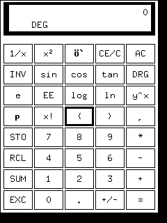

# GUI Automation

GUI Automation построена на библиотеке pyautogui, в которой имеется
возможность находить изображение на экране с помощью компьютерного зрения.

Последовательность и описание тестов задаются через конфиг в формате 
JSON, поддерживающий добавление python кода, для увеличения гибкости тестов
без изменения самой программы.

## Примеры работы

## Особенности

Linux программы запускаются на виртуальном фреймбуфере, что позволяет
использовать тесты в CI.

После прохождения тестов создается gif-анимация, содержащая, что было с программой до
теста и после.

## Зависимости

Для работы программы нужны следующие пакеты:
 + Общие пакеты:
   - pyautogui -- взаимодействие с интерфейсами
   - imageio -- сохранение gif'ок
   - opencv -- для поиска элементов на экране
 + Linux:
   - python-xlib -- для работы с виртуальными дисплеями
   - pyvirtualdisplay -- для работы с виртуальными дисплеями
   - xvfb -- для работы с виртуальными дисплеями
   - scrot -- для скриншотов

## Примеры работы

### Freedoom1

Freedoom, конечно, содержит не совсем тот интерфейс, который можно
было бы распознать достаточно точно с помощью компьютерного зрения,
но зато его [конфигурационный файл](examples/freedoom1.json)
демонстрирует вставку кода на python и разбиение тестов на подтесты.

### Xcalc

Xcalc -- простой пример автоматизации интерфейса с помощью 
распознавания изображений

